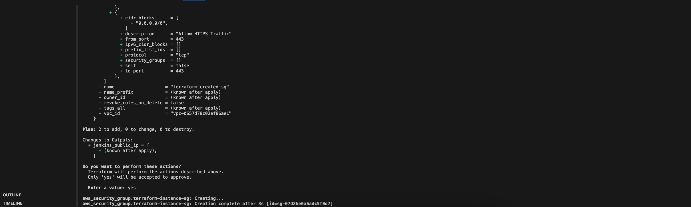
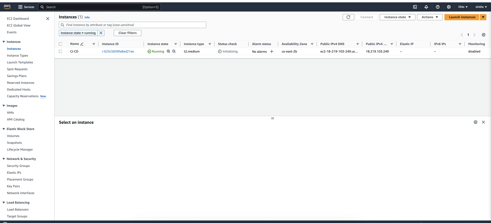
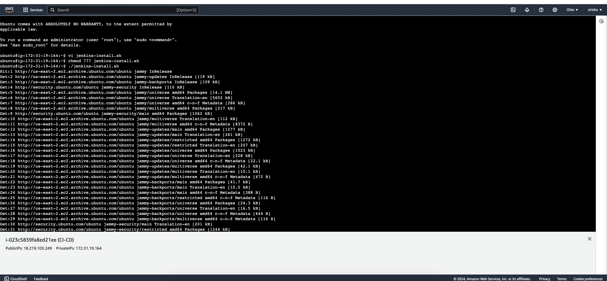
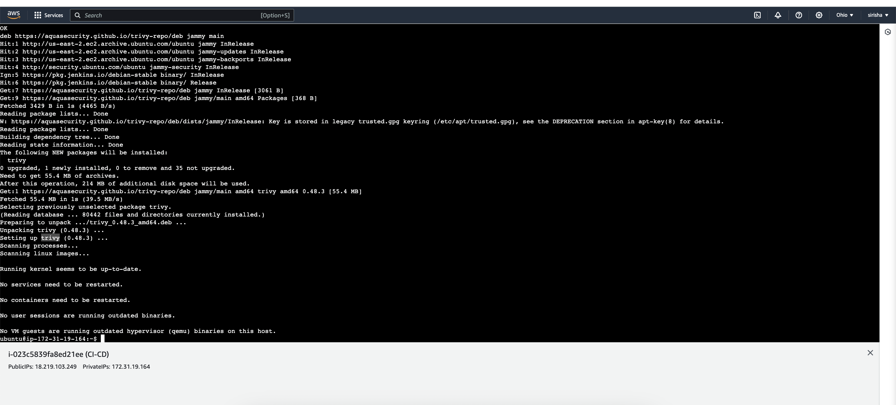
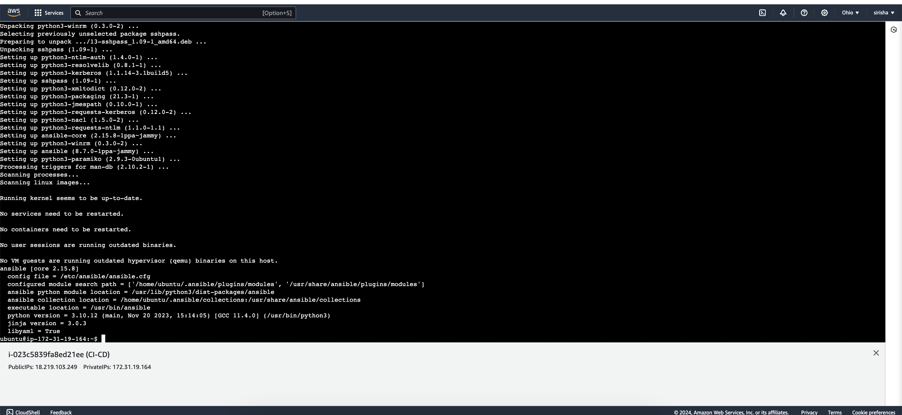
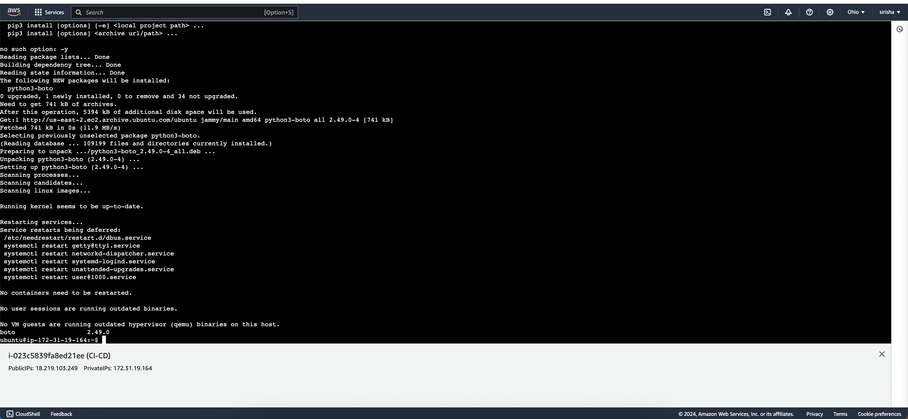
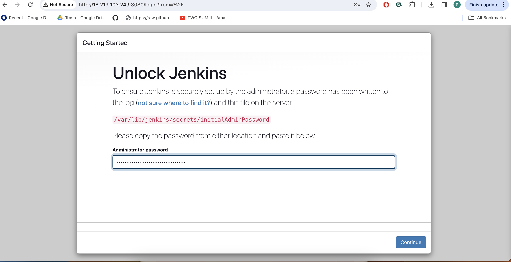
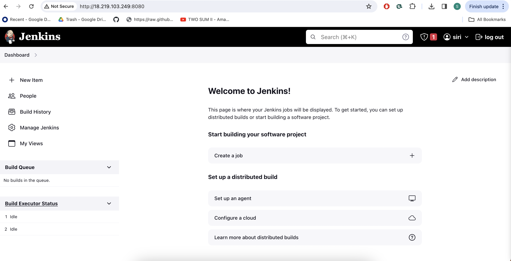

# Efficient AWS Infrastructure Management

## Introduction
Ansible and Jenkins for streamlined AWS infrastructure management. Leveraging Infrastructure as Code (IaC), automate EC2 provisioning for efficient, reliable deployments.

## Technologies
**Ansible**: Automates AWS resource provisioning and configuration.
**Jenkins**: Manages deployment pipelines and integrates with Ansible for continuous integration.
**AWS**: Provides scalable cloud computing resources.
**Docker**: Facilitates application containerization for versatile deployments.
**Trivy**: Performs security scanning to identify system vulnerabilities.
**Boto/Boto3**: Python libraries for AWS interactions.
**GitHub**: Hosts our code repository for collaboration and version control.

## Project Architecture


## Project steps:

Step 1: Launch ec2 instance with t2.micro and ubuntu AMI. I have used following terraform file to launch it.


```
    provider "aws" {
      region = "us-east-1" # Change this to your desired AWS region
    }

    resource "aws_instance" "my_instance" {
      count = 1


      ami                    = "ami-0fc5d935ebf8bc3bc" # Specify the AMI ID for your desired Amazon Machine Image
      instance_type          = "t2.medium"
      key_name               = "linux-kp" # Change this to your key pair name
      vpc_security_group_ids = [aws_security_group.terraform-instance-sg.id]


      tags = {
        Name = "CI-CD"
      }


    }

    output "jenkins_public_ip" {
        value = [for instance in aws_instance.my_instance : instance.public_ip]

    }


    #Create security group 
    resource "aws_security_group" "terraform-instance-sg" {
      name        = "terraform-created-sg"
      description = "Allow inbound ports 22, 8080"
      vpc_id      = "vpc-0bb95d14e92638eb6"

      #Allow incoming TCP requests on port 22 from any IP
      ingress {
        from_port   = 22
        to_port     = 22
        protocol    = "tcp"
        cidr_blocks = ["0.0.0.0/0"]
      }
      #Allow incoming TCP requests on port 443 from any IP
      ingress {
        description = "Allow HTTPS Traffic"
        from_port   = 443
        to_port     = 443
        protocol    = "tcp"
        cidr_blocks = ["0.0.0.0/0"]
      }

      #Allow incoming TCP requests on port 8080 from any IP
      ingress {
        from_port   = 80
        to_port     = 80
        protocol    = "tcp"
        cidr_blocks = ["0.0.0.0/0"]
      }

      #Allow incoming TCP requests on port 8080 from any IP
      ingress {
        from_port   = 8080
        to_port     = 8080
        protocol    = "tcp"
        cidr_blocks = ["0.0.0.0/0"]
      }


      #Allow all outbound requests
      egress {
        from_port   = 0
        to_port     = 0
        protocol    = "-1"
        cidr_blocks = ["0.0.0.0/0"]
      }
    }
```



Install Jenkins and Trivy :

SSH into created ec2 instance and make following .sh files to install required package

**jenkins-install.sh**
```
 #!/bin/bash

 sudo apt update -y
 sudo apt install fontconfig openjdk-17-jre -y
 sudo wget -O /usr/share/keyrings/jenkins-keyring.asc \
   https://pkg.jenkins.io/debian-stable/jenkins.io-2023.key
 echo deb [signed-by=/usr/share/keyrings/jenkins-keyring.asc] \
   https://pkg.jenkins.io/debian-stable binary/ | sudo tee \
   /etc/apt/sources.list.d/jenkins.list > /dev/null
 sudo apt-get update -y
 sudo apt-get install jenkins -y
 sudo systemctl enable jenkins
 sudo systemctl start jenkins
 sudo systemctl status jenkins
```
Run following command to install it.
```
 chmod 777 jenkins-install.sh
 ./jenkins-install.sh
```


**trivy-install.sh**
```
 #!/bin/bash
 sudo apt-get install wget apt-transport-https gnupg lsb-release -y
 wget -qO - https://aquasecurity.github.io/trivy-repo/deb/public.key | sudo apt-key add -
 echo deb https://aquasecurity.github.io/trivy-repo/deb $(lsb_release -sc) main | sudo tee -a /etc/apt/sources.list.d/trivy.list
 sudo apt-get update -y
 sudo apt-get install trivy -y
```

Run following command to install it.

```
 chmod 777 trivy-install.sh
 ./trivy-install.sh
```



**ansible-install.sh**
```
 #!/bin/bash
 sudo apt update -y
 sudo apt install spftware-properties-common
 sudo add-apt-repository --yes --update ppa:ansible/ansible
 sudo apt install python3 -y
 sudo apt install ansible -y
 ansible --version
```

Run Following command to install it.
```
 chmod 777 ansible-install.sh
 ./ansible-install.sh
```



**boto-install.sh**

```
 #!/bin/bash
 sudo apt install python3-pip -y
 sudo pip3 install boto boto3 -y
 sudo apt-get install python3-boto -y
 pip list boto | grep boto
```
Run following command to install it
```
 chmod 777 boto-install.sh
 ./boto-install.sh
```


After executing these scripts, grab your EC2 instance's Public IP Address and open it in the browser:
```
 http://<EC2 Public IP Address:8080>
```

It will prompt for a password, which you can obtain using:




get password by following command:

```
sudo cat /var/lib/jenkins/secrets/initialAdminPassword
```

Create a user, click save, and continue. Explore Jenkins via the Getting Started Screen.

