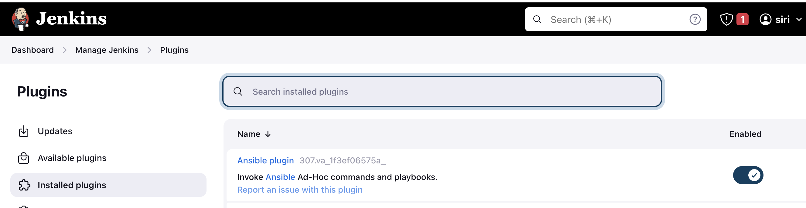
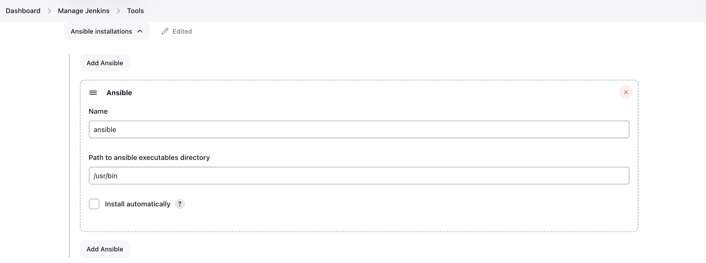

# Efficient AWS Infrastructure Management with Ansible and Jenkins

## Introduction

This project focuses on utilizing Ansible and Jenkins for efficient AWS infrastructure management. It aims to automate EC2 provisioning through Infrastructure as Code (IaC), ensuring reliable and streamlined deployments

## Technologies

**Ansible**: Automates AWS resource provisioning and configuration.

**Jenkins**: Manages deployment pipelines and integrates with Ansible for continuous integration.

**AWS**: Provides scalable cloud computing resources.

**Docker**: Facilitates application containerization for versatile deployments.

**Trivy**: Performs security scanning to identify system vulnerabilities.

**Boto/Boto3**: Python libraries for AWS interactions.

**GitHub**: Hosts our code repository for collaboration and version control.


## Project Architecture


## Project steps:

1. **Launch EC2 Instance**
   - Use Terraform to launch an EC2 instance with a specified script

```
    provider "aws" {
      region = "us-east-1" # Change this to your desired AWS region
    }

    resource "aws_instance" "my_instance" {
      count = 1


      ami                    = "ami-0fc5d935ebf8bc3bc" # Specify the AMI ID for your desired Amazon Machine Image
      instance_type          = "t2.medium"
      key_name               = "linux-kp" # Change this to your key pair name
      vpc_security_group_ids = [aws_security_group.terraform-instance-sg.id]


      tags = {
        Name = "CI-CD"
      }


    }

    output "jenkins_public_ip" {
        value = [for instance in aws_instance.my_instance : instance.public_ip]

    }

    #Create security group 
    resource "aws_security_group" "terraform-instance-sg" {
      name        = "terraform-created-sg"
      description = "Allow inbound ports 22, 8080"
      vpc_id      = "vpc-0bb95d14e92638eb6"

      #Allow incoming TCP requests on port 22 from any IP
      ingress {
        from_port   = 22
        to_port     = 22
        protocol    = "tcp"
        cidr_blocks = ["0.0.0.0/0"]
      }
      #Allow incoming TCP requests on port 443 from any IP
      ingress {
        description = "Allow HTTPS Traffic"
        from_port   = 443
        to_port     = 443
        protocol    = "tcp"
        cidr_blocks = ["0.0.0.0/0"]
      }

      #Allow incoming TCP requests on port 8080 from any IP
      ingress {
        from_port   = 80
        to_port     = 80
        protocol    = "tcp"
        cidr_blocks = ["0.0.0.0/0"]
      }

      #Allow incoming TCP requests on port 8080 from any IP
      ingress {
        from_port   = 8080
        to_port     = 8080
        protocol    = "tcp"
        cidr_blocks = ["0.0.0.0/0"]
      }


      #Allow all outbound requests
      egress {
        from_port   = 0
        to_port     = 0
        protocol    = "-1"
        cidr_blocks = ["0.0.0.0/0"]
      }
    }
```


2. **Install Jenkins**
   - SSH into the created EC2 instance.
   - Execute `jenkins-install.sh` to install Jenkins.

**jenkins-install.sh**

```
 #!/bin/bash

 sudo apt update -y
 sudo apt install fontconfig openjdk-17-jre -y
 sudo wget -O /usr/share/keyrings/jenkins-keyring.asc \
   https://pkg.jenkins.io/debian-stable/jenkins.io-2023.key
 echo deb [signed-by=/usr/share/keyrings/jenkins-keyring.asc] \
   https://pkg.jenkins.io/debian-stable binary/ | sudo tee \
   /etc/apt/sources.list.d/jenkins.list > /dev/null
 sudo apt-get update -y
 sudo apt-get install jenkins -y
 sudo systemctl enable jenkins
 sudo systemctl start jenkins
 sudo systemctl status jenkins
```
Run following command to install it.
```
 chmod 777 jenkins-install.sh
 ./jenkins-install.sh
```


3. **Install Trivy**
   - Run `trivy-install.sh` script on the EC2 instance to install Trivy.
   
```
 #!/bin/bash
 sudo apt-get install wget apt-transport-https gnupg lsb-release -y
 wget -qO - https://aquasecurity.github.io/trivy-repo/deb/public.key | sudo apt-key add -
 echo deb https://aquasecurity.github.io/trivy-repo/deb $(lsb_release -sc) main | sudo tee -a /etc/apt/sources.list.d/trivy.list
 sudo apt-get update -y
 sudo apt-get install trivy -y
```

Run following command to install it.

```
 chmod 777 trivy-install.sh
 ./trivy-install.sh
```


4. **Install Ansible**
   - Execute `ansible-install.sh` on the EC2 instance for Ansible installation.

```
 #!/bin/bash
 sudo apt update -y
 sudo apt install spftware-properties-common
 sudo add-apt-repository --yes --update ppa:ansible/ansible
 sudo apt install python3 -y
 sudo apt install ansible -y
 ansible --version
```

Run Following command to install it.

```
 chmod 777 ansible-install.sh
 ./ansible-install.sh
```


5. **Install Boto**
   - Run `boto-install.sh` to install Boto and Boto3 on the EC2 instance.

**boto-install.sh**

```
 #!/bin/bash
 sudo apt install python3-pip -y
 sudo pip3 install boto boto3 -y
 sudo apt-get install python3-boto -y
 pip list boto | grep boto
```
Run following command to install it

```
 chmod 777 boto-install.sh
 ./boto-install.sh
```


6. **Access Jenkins**
   - Open Jenkins using the Public IP of the EC2 instance.
   - Complete Jenkins setup using the initial admin password.
   
```
 http://<EC2 Public IP Address:8080>
```

It will prompt for a password, which you can obtain using:


```
sudo cat /var/lib/jenkins/secrets/initialAdminPassword
```


7. **Create IAM Role for EC2**
   - Create a new IAM role with EC2 full access in AWS IAM Console.

- Go to IAM Console, click `Create Role`.
- Select `EC2` use case, then `Next`.
- Search and select `AmazonEc2FullAccess`, click `Next`.
- Name the role, click `Create Role`.
- In EC2 Dashboard, select instance, modify IAM role.


8. **Add Ansible Plugin to Jenkins**
   - Install the Ansible plugin in Jenkins through the Manage Plugins section.

- Navigate to **Manage Jenkins**.
- Select **Manage Plugins**.
- Go to the **Available** tab.
- Search for `Ansible`.
- Install the plugin.



Now get path of installed ansible using following command:

```
which ansible
```

```
ubuntu@ip-172-31-19-164:~$ which ansible
/usr/bin/ansible
```

9. **Configure Ansible in Jenkins**
   - Add the installed Ansible path in Jenkins configuration.



- create an Ansible playbook and upload it to your GitHub repository. The playbook provisions a new EC2 instance and security group. Here is a sample playbook:

```
---
- name: Povising a new ec2 instance and sg
  hosts: localhost
  connection: local
  gather_facts: False
  tags: provisioning

  pre_tasks:
    - name: Gather facts
      setup:
    - name: print python version
      debug:
        msg: "Using Python {{ ansible_python_version }}"
    - name: Install dependencies
      shell: "/usr/bin/python3.10 -m pip install {{ item }}"
      loop:
      - boto3
      - botocore
  vars:
    ansible_python_interpreter: /usr/bin/python3.10
    keypair: linux-kp
    instance_type: t2.micro
    image_id: ami-0c7217cdde317cfec
    wait: yes
    group: webserver
    count: 1
    region: us-east-2
    security_group: ec2-security-group
    tag_name:
      Name: demo-ec2

  tasks:

    - name: Create a security group
      amazon.aws.ec2_group:
        name: "{{ security_group }}"
        description: Security group for web server instance
        region: "{{ region }}"
        rules:
          - proto: tcp
            from_port: 22
            to_port: 22
            cidr_ip: 0.0.0.0/0
          - proto: tcp
            from_port: 8080
            to_port: 8080
            cidr_ip: 0.0.0.0/0
          - proto: tcp
            from_port: 5000
            to_port: 5000
            cidr_ip: 0.0.0.0/0  
          - proto: tcp
            from_port: 80
            to_port: 80
            cidr_ip: 0.0.0.0/0
          - proto: tcp
            from_port: 443
            to_port: 443
            cidr_ip: 0.0.0.0/0
        rules_egress:
          - proto: all
            cidr_ip: 0.0.0.0/0
      register: basic_firewall
    - name: Launch the new ec2 INstance
      amazon.aws.ec2_instance:
        security_group: "{{ security_group }}"
        instance_type: "{{ instance_type }}"
        image_id: "{{ image_id }}"
        wait: "{{ wait }}"
        region: "{{ region }}"
        key_name: "{{ keypair }}"
        count: "{{ count }}"
        tags: "{{ tag_name }}"
        user_data: |
          #!/bin/bash
          sudo apt update -y
          sudo apt install docker.io -y
          sudo systemctl start docker
          sudo systemctl enable docker
          docker run -d --name game -p 8080:80 siri/docker-2048
      register: ec2
```


10. **Create Jenkins Pipeline**
    - Create and execute a Jenkins pipeline with provided code for tasks like Trivy security scanning and Ansible provisioning.

```
pipeline {
    agent any
    tools{
        ansible 'ansible'
    }
    stages {
        stage('cleanws') {
            steps {
                cleanWs()
            }
        }
        stage('checkout'){
            steps{
                git branch: 'main', url: 'https://github.com/sirishacyd/aws-ansible-jenkins'
            }
        }
        stage('TRIVY FS SCAN') {
            steps {
                sh "trivy fs . > trivyfs.txt"
            }
        }    
        stage('ansible provision') {
          steps {
             // To suppress warnings when you execute the playbook    
             sh "pip install --upgrade requests==2.20.1"
             ansiblePlaybook playbook: 'ec2.yml' 
            }
        }
    }
}
```


11. **Access the Deployed Game**
    - Use the Public IP of the new EC2 instance to access the deployed game.

- Retrieve the **Public IP** newly provisioned instance.
- visit `http://<public-ip>:8080`


This project effectively combines Terraform, Ansible, and Jenkins to manage AWS infrastructure. It offers a seamless deployment pipeline with security and containerization, ideal for scalable and secure cloud operations
